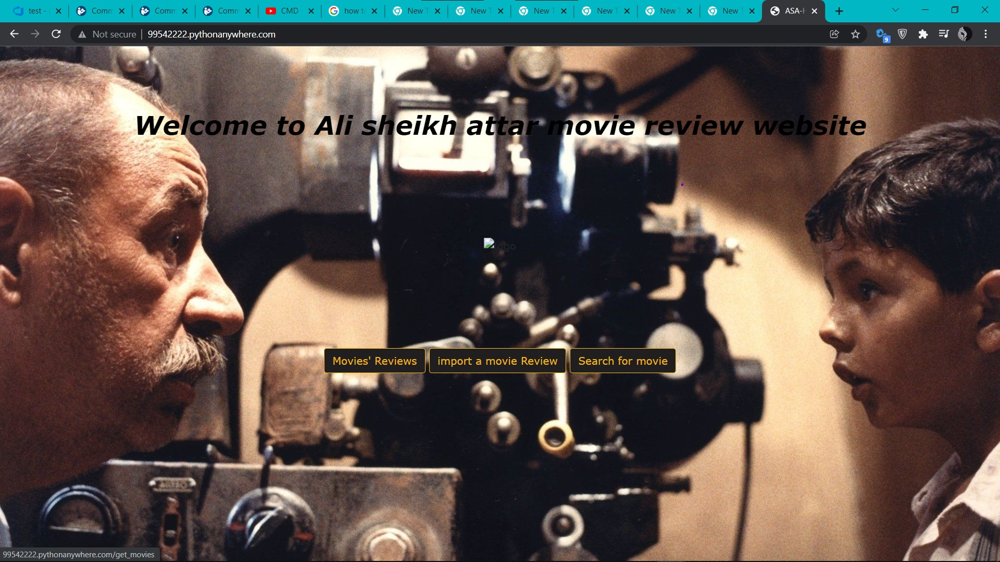

my project is a film review website that people can register on that and write their own one about a specific movie and share their thoughts with others and read others opinion
everyone will have unique username which allow them to know the other user point of view about every other movie.

[link](http://99542222.pythonanywhere.com/)

<!-- 
Format:  -->
<!--  -->

---